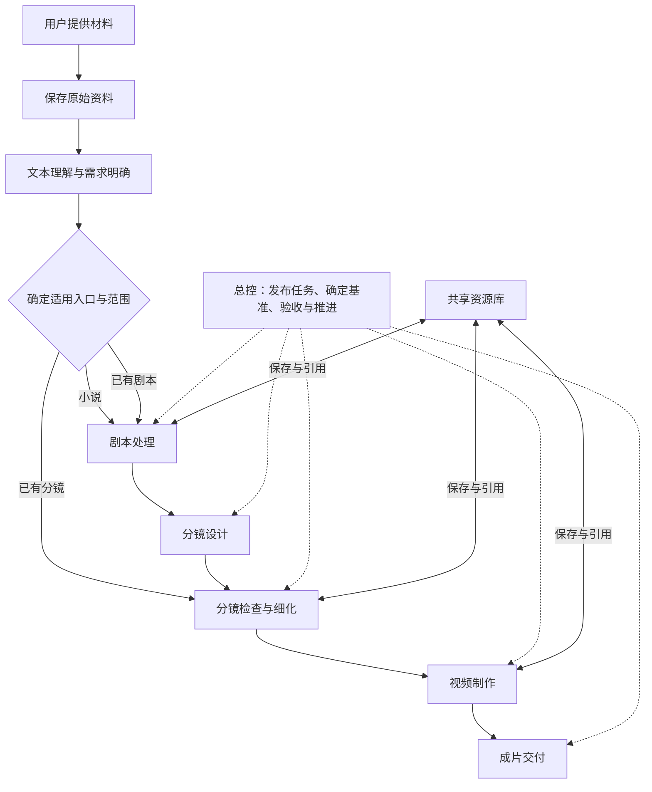
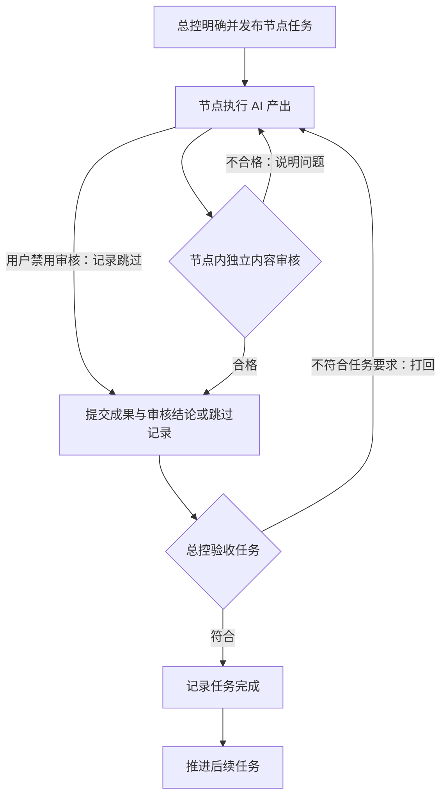
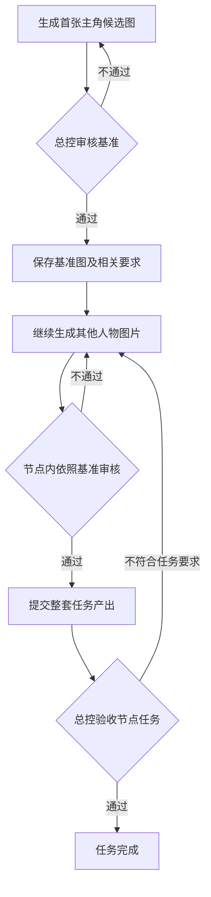

# 映序 · AI 短剧工作台产品需求文档

版本：v0.12 · 总分总流程与新版 Mock 实施范围

日期：2026-09-17  
状态：产品框架、前期需求确认顺序及原作分析职责已确认，其余具体交互、节点任务与实现方案待继续讨论。下一轮先使用 Mock 验证，不新增数据库设计或后端实现。

本文整理本轮讨论确定的产品方向，作为后续需求讨论的基线。文中需求不等于现有系统已经实现；当前能力仍以代码和《实施状态》为准。本工程以此为产品需求基线；不继承旧工程的数据库、接口及兼容要求。

## 1. 产品定位

后续已确认、待实现的补充见 [后续改造清单](./后续改造清单.md)：默认添加剧本入口、原始会话查看、节点内自动独立审核与问题转交、全局阅读体验。审核调度以该补充为下一轮改造依据；当前实现状态仍见《实施边界》。

面向个人和团队的 AI 短剧制作工作台。从用户提供的小说、剧本、分镜等材料开始，组织制作任务、参与者、资源和审核，逐步形成可交付的作品。

**核心原则：产品主流程固定，节点内任务按实际项目展开；总控把握方向、发布任务并验收，节点内部负责执行与独立内容审核。**

本轮从已有故事或制作材料开始，不将从零创作故事作为核心入口。

## 2. 产品框架

产品主阶段为：**文本理解与需求明确 → 剧本处理 → 分镜设计 → 视频制作 → 成片交付**。图中的分镜检查与细化属于分镜阶段，并为直接上传分镜提供入口。

主阶段由产品定义，总控根据材料、目标和制作范围安排本项目适用的阶段及内部任务。无需经历的处理环节可以跳过，不能将“跳过”表示为已经执行完成。不同入口不强制重新生成用户已经提供的内容。

项目流程确认前，流程大纲展示区保持空白，待讨论方案在总控群里查看；确认后展示正式流程。固定的产品框架与某个项目是否已确认制作安排，属于两个不同层面。

## 3. 主要使用场景

| 场景                   | 需要明确的事情                               | 进入方式                               |
| ---------------------- | -------------------------------------------- | -------------------------------------- |
| 上传小说，希望改编     | 做整本还是选定片段，希望做成什么、做到哪一步 | 按需理解原作，确定范围，进入剧本处理   |
| 上传小说，只做中间部分 | 指定范围、必要前情、独立成剧所需衔接         | 围绕目标范围阅读，补充必要背景后改编   |
| 上传已有剧本           | 内容成熟度、需要整理或调整的范围             | 进入剧本处理或后续分镜阶段             |
| 上传写好的分镜词       | 分镜是否合理，是否缺少人物、场景等前置资源   | 检查和细化分镜，按需补资源，再制作视频 |

上传类型判断、目标澄清和阅读策略由 AI 处理。系统负责保存与查询原始资料，不在上传存储环节擅自改写内容。混合材料、材料不完整或类型不明确的具体交互待定。

### 长文本理解

采用增量理解，允许 AI 根据目标范围与当前任务按需读取。不限于固定章节数，也不要求原作必须分章。用户上传整本小说，不代表要求制作整本。

应保留已读范围、相关依据和仍未知的信息，不能将局部阅读结论标为全书结论。具体阅读记录、阶段判断和前后文补查规则待细化。

### 前期开展顺序

**上传内容与可选偏好 → 原作分析 AI 按需理解内容 → 总控结合分析与偏好沟通 → 确认制作需求 → 开展下一节点任务。**

用户可以不选择偏好。无论是否选择，第一项内容工作都是理解上传材料；偏好只是初始意向，不是已经确认的制作要求，也不是开始理解内容的前置门槛。

总控拿到经审核的初步理解报告后，与用户明确以下六项方向：

| 确认项     | 内容                                 |
| ---------- | ------------------------------------ |
| 制作目标   | 做到剧本、分镜，还是最终视频         |
| 制作范围   | 全部故事、指定章节或片段、先做一部分 |
| 画面风格   | 真人影视感、动漫、水墨等             |
| 集数与时长 | 计划多少集、每集大概多久             |
| 画幅       | 横屏、竖屏或其他比例                 |
| 改编要求   | 忠实原文、适当压缩，还是允许较大改编 |

- 未填写的项目：结合内容提出建议，与用户沟通确认。
- 已填写且适配的项目：直接沿用，不重复询问。
- 已填写但不太适配的项目：说明原因、提出替代建议，由用户决定，不擅自覆盖用户选择。
- 用户可以明确将某项交给 AI 提出建议；此时应明确下一项任务需要解决的问题，不把待建议内容冒充为已确定结论。

上述方向达成一致后，总控可以发布下一节点任务，具体内容在后续节点逐步细化。“理解完成”指达到足以讨论制作方向的程度，不要求先读完整本小说。

### 原作分析 AI 的职责与交付

小说、剧本、分镜等上传材料的初步理解由**原作分析 AI**负责；总控根据分析结果与用户沟通制作需求。

这一阶段交付**初步内容理解报告**，包括：

| 结论         | 内容                                                                                 |
| ------------ | ------------------------------------------------------------------------------------ |
| 材料类型     | 小说、剧本、分镜词，还是其他内容                                                     |
| 内容概况     | 主要讲什么、属于什么题材；已有明确情节时概括核心冲突                                 |
| 核心元素     | 已识别的主要人物及关系、背景、重要场景等，按内容适用；不为科普等材料强行套用人物结构 |
| 材料完成程度 | 完整故事、局部片段，还是已经细化到可制作的分镜；证据不足时明确未知                   |
| 制作方向建议 | 适合怎样呈现，用户已有偏好是否存在明显不适配                                         |
| 待确认事项   | 哪些问题需要总控向用户了解，哪些需要后续继续阅读                                     |

报告必须注明**已读范围、相关依据、原文明示内容、推测及尚不清楚的信息**，不能把局部理解写成全书定论。这一步不直接改编故事，不替用户确定集数、时长。报告作为实际成果保存，经总控审核后用于需求讨论；前期节点内独立内容审核的具体标准仍待细化。

### 制作需求的保存与引用

总控了解基本信息并与用户确认整体制作方案后，应整理并正式保存一份**制作需求**，作为后续节点工作的共同依据，不能只保留在聊天记录中。保存内容包括：

| 内容             | 记录要求                                             |
| ---------------- | ---------------------------------------------------- |
| 原作分析报告引用 | 关联已经审核的内容理解结果及其明确版本               |
| 已确认的制作方向 | 制作目标、范围、风格、集数与时长、画幅、改编要求     |
| 补充要求         | 用户明确提出的保留内容、禁改内容及其他约束           |
| 尚未确定的事项   | 单独列出哪些问题交给后续节点解决，不标记为已确认结论 |

由总控整理保存，后续发布任务时引用这份制作需求。需求调整时保留历史版本，并明确当前生效版本；不能仅凭聊天中的新说法覆盖正式要求。用户上传时的可选偏好仍只是沟通输入，不自动等同于这份正式需求。

本轮记录保存与引用的产品要求，具体存储结构、版本切换交互及变更影响处理待细化，先用 Mock 验证。

## 4. 流程节点与任务

### 总分总的流程展示

新版按一份整体剧本向下展开多个剧集，每集再展开多个分镜，镜头视频汇合成对应的整集视频，所有整集视频最终接到一个归档流程节点。例如 **1 份剧本 → 10 集 → 每集 10 个分镜 → 10 个整集视频 → 归档**。10 是此次引导结构示例，不作为产品数量上限或固定业务规则。

节点可点击查看信息，较多分镜可以收起再展开；归档节点本轮只保留空的查看位置，不添加内部内容。按用户要求，新版尤其重写资产定义与查看界面，仅复用成熟的基础组件。当前先实现 Mock，实际能力与限制见 [新版交互预览](实施边界.md)。

### 已确认规则

- 每个流程节点承接由总控发布的任务，明确这个节点要完成什么及需要交付什么。
- 节点可以包含内部子节点或子任务，承载更细的执行过程。
- 节点可以由多个 AI 参与；团队制作时也可以由人参与。
- 总控验收通过后，节点任务才标记为完成，流程再推进到后续任务。
- 产出了文件、AI 声称完成或内部审核通过，都不单独代表节点任务完成。
- 如有并行分支，后续任务应满足其必要前置条件；具体调度规则待定。

### 节点工作空间

节点承载：**总控发布的任务、参与的人与 AI、讨论记录、输入引用、产出、基准与审核记录**。

大阶段如何拆为节点，一个节点何时建立多项任务，任务能否并行，以及子流程由谁具体协调，后续逐项确定。不为所有节点统一规定固定子任务清单、AI 数量或嵌套层数；已讨论节点的具体配置如下。

### 剧本节点：两个 AI

当前方案中，剧本制作节点内部只保留两个 AI：

| 参与者      | 职责                                                                                 |
| ----------- | ------------------------------------------------------------------------------------ |
| 编剧 AI     | 承担原作研读、改编规划、分集规划、剧本编写，推进内部工作，依据审核意见修改并整理交付 |
| 独立审核 AI | 检查各模块产出，提出修改意见并复审，检查整体剧本的连续性、一致性及完整性             |

内部工作按原作研读 → 改编规划 → 分集规划 → 剧本编写 → 整体校核组织；模块划分工作，不逐模块新建 AI。当前不在剧本节点增加研读助手、分集编写助手等下级 AI；其他节点的配置另行讨论。

剧本编写应用第 6 节的通用样稿机制：先交代表性样稿，经内部审核与总控基准审核后继续其余制作。总控负责发布任务、确定基准和最终验收，不计入节点内部这两个 AI。两个 AI 的具体提示词、Skill、审核标准和返工细节后续完善。

### 分集分镜与资产制作分工

剧本交付时，编剧应推荐用于建立后续制作基准的代表性剧集及片段，并说明理由，由总控确定，不固定选择第一集。

“分镜设计”是阶段容器，按集建立具体制作节点，汇总各集进度，不由一个节点承担所有集的具体工作。每集拥有独立任务、聊天、产出及审核状态，引用对应分集剧本、公共资产和已确定基准，必要时查询相邻集以保持衔接。总控按集发布与验收任务；默认优先贯通代表性剧集，用户可以选择提前横向开展满足实际产出依赖的任务，不能因默认顺序锁住无关剧集。具体并行与调度交互仍待细化。

一集内部按**分集剧本 → 场景拆分 → 镜头拆分 → 逐镜头分镜词**推进，可以按场景分批处理。镜头时长根据动作和内容确定，不把整集当作一个几秒钟的生成任务。

| 工作                             | 负责方          | 产出与边界                                                             |
| -------------------------------- | --------------- | ---------------------------------------------------------------------- |
| 提取人物、服装、场景、道具等需求 | 资产分析 AI     | 资产需求清单，关联可复用资产，列出缺失或不适配项                       |
| 生成人物图、场景图等             | 对应资产制作 AI | 独立制作任务中的图像成果，经审核后供引用                               |
| 拆镜头、设计画面、编写分镜词     | 分镜 AI         | 镜头编号、画面、动作与对白、景别与运镜、预计时长、资产引用或待补需求   |
| 审核分镜                         | 独立审核 AI     | 核查是否符合剧本、衔接是否连贯、动作是否能在时长内完成、描述是否可执行 |

每集分镜节点保留分镜 AI 与独立审核 AI，资产分析与图像制作作为独立工作，不全部交给分镜 AI。分镜设计发现新的资产需求时，再反馈给总控安排补充，不要求开始前做齐所有资产。资产复用与新建遵守第 7 节规则。

分镜应用通用基准机制，默认在分镜通过后优先向下验证代表性镜头视频与整集效果，再扩展其他集。用户也可以提前选择横向制作已有可用剧本对应的分镜，未验证的视频或整集效果不能作为已验证基准。特殊风格或表现要求需要补充基准时交总控审核。各集完成后由总控验收。资产分析及制作任务如何配置 AI、具体生成方式与接口后续讨论。

### 镜头画面与视频制作

镜头制作按职责划分模块，首帧、关键动作图和尾帧归入同一个“镜头画面制作”模块，不分别设置专用 AI：

| 模块         | 默认 AI 配置                                    | 职责                                                                                   |
| ------------ | ----------------------------------------------- | -------------------------------------------------------------------------------------- |
| 分镜设计     | 分镜 AI＋审核 AI                                | 明确动作过程，列出所需首帧、关键动作图、尾帧及顺序                                     |
| 基础资产准备 | 资产制作 AI＋审核 AI                            | 根据资产需求清单查询、复用或制作人物、服装、场景、道具等公共资产                       |
| 镜头画面制作 | 画面制作 AI＋审核 AI                            | 引用基础资产制作各类镜头画面，检查画面之间的一致性                                     |
| 镜头视频制作 | 当前由人工处理；视频制作 AI＋审核 AI 为后续方向 | 保留分镜词与制作说明，人工处理镜头视频后将成果保存到对应流程位置，暂不接入自动视频制作 |

关键动作图描述重要姿态、位置或接触关系；需要控制结束状态或衔接下个镜头时提供尾帧，不要求所有镜头固定配齐三类图。当前由人工根据外部生成工具支持的方式使用参考画面；视频 AI 的接入与具体工具能力后续确定。

镜头画面存入公共资产库，关联所属镜头、基础资产及动作说明，后续可查询复用。各模块默认执行内部审核，再由总控验收；用户禁用内部审核时按下述规则处理。代表性镜头到整集再到其他集的推进属于默认优先顺序，用户调整顺序时仍须满足所选任务的实际产出依赖。

### 当前范围：视频人工处理与成果保存

视频制作及整集合成暂不细化内部模块。当前只保留流程中的文本与成果存储位置：

- 镜头对应位置保存分镜词、制作说明等文本，以及已有参考资产的引用，供人工取用。
- 人工处理分镜视频后，支持上传并保存到对应镜头的流程位置。
- 人工合成整集视频后，支持上传并保存到对应剧集的流程位置。
- 从流程节点可以查看已保存文本和关联视频，文件与镜头、剧集保持明确对应，不只留在聊天中。

暂不拆分自动剪辑、配音、音效、配乐、字幕等模块，不新增相应 AI 或自动合成能力。人工保存视频不自动等于审核通过或任务完成；人工交付后的具体验收交互后续讨论。代表性优先顺序与实际依赖规则仍保留，视频成果可由人工补入。

以上是本轮确定的产品范围，后续先用 Mock 展示文本位置和人工成果入口，不因本次记录新增数据库或自动制作实现。

### 流程图中的 AI 启用与禁用

用户可以在流程图中点击节点，查看其中的 AI 并禁用对应 AI。禁用行为根据其在流程中的作用区分，不仅是停止发送聊天消息：

| 禁用对象               | 流程行为                                                               | 展示状态                                   |
| ---------------------- | ---------------------------------------------------------------------- | ------------------------------------------ |
| 节点内审核 AI          | 跳过对应内部审核环节，继续进入原有后续步骤；总控基准审核与任务验收保留 | 审核已跳过（用户禁用），不能伪装成审核通过 |
| 必要执行 AI，如分镜 AI | 当前任务停在该执行环节，依赖其产出的后续任务不启动，不能绕过继续执行   | 当前环节已禁用，后续依赖等待               |

必要执行环节的禁用或暂停只阻止该任务继续执行，以及缺少其必需产出的后续任务，不把所有下游 AI 的自身开关改成禁用，也不因此停掉无依赖关系的其他分支。已有正式可用的成果及历史审核记录保留，不因暂停执行自动失效；不能将未执行的任务标为完成。流程页面应区分“用户禁用／暂停”与“因缺少上游产出而等待”。

该功能适用于各类节点。本文前述内部审核流程均为默认启用路径；用户可以明确跳过内部审核，但跳过不授予成果可用标记，仍遵守总控正式验收与基准确认规则。团队中哪些用户可操作、禁用时已在运行任务的处理及重新启用后的恢复细节待定；本轮只记录产品要求，后续先用 Mock 验证。

## 5. 两层审核与推进机制

| 参与者           | 核心职责                                                             | 权限边界                                                             |
| ---------------- | -------------------------------------------------------------------- | -------------------------------------------------------------------- |
| 总控             | 把握整体方向，发布任务，确认基准，验收产出是否符合节点目标，推进流程 | 根据实际产出和审核结论作出任务验收决定；不逐项承担节点内部专业检查   |
| 节点执行 AI      | 根据任务和指定输入形成候选成果，按意见修改                           | 不能自行将自己的成果批准为最终交付                                   |
| 节点独立审核 AI  | 审查内容质量、合理性及是否符合既定基准，指出问题并复审               | 内容审核通过不等于总控任务验收通过；不能自行修改总控确定的方向和基准 |
| 用户或节点参与者 | 讨论需求、提出意见，按参与范围介入制作                               | 参与聊天不自动获得所有审核或流程推进权限                             |

“三方审核”在本文指独立于执行者的审核角色，不表示必须采用三个模型或三家服务商。审核 AI 的选择、独立上下文、审核标准及发生分歧后的处理待细化。

内容审核和总控任务验收分别记录，并关联实际成果版本。**一切以正式状态和审核记录为准，不以聊天中的表述为准。**

### 默认控制方与用户介入

审核与流程推进默认由总控组织和把控，不将用户逐节点点击作为正常制作的前提。独立审核 AI 负责专业内容检查；总控结合节点目标、实际产出和审核结论决定验收通过、打回修改或继续下一任务。自动把控不等于产出后自动通过，仍须正式的审核与验收记录。

用户可以在需要时点击审核、验收或退回等入口进行人工介入；这些入口属于辅助控制，不是每一步的必填操作。用户操作同样须遵守前置产出、版本和记录要求，不可仅凭聊天声明改变可用状态。正式执行接入时区分总控决定与用户介入的主体和依据，团队成员具体权限另行确定。

当前 Mock 页将操作收在“人工介入（演示）”中，不将手动演示冒充已运行的总控审核，也不因为收起按钮而自动批准产出。

超出节点任务范围、需要调整整体方向或修改已确认基准的问题，应提交总控决定。反复返工仍无法通过时，应由总控协调；具体升级条件待定。

## 6. 通用样稿与基准审核机制

**这是可供各类适用节点复用的通用功能，不限于剧本制作或人物图片生成。** 一个任务可能产生多项成果，允许先制作具有代表性的样稿或样品，确定基准后再开展其余制作。总控可以在整个任务完成之前审核这个基准。

通用流程为：**先做样稿或样品 → 节点内部审核 → 总控审核并确定基准 → 依照基准继续制作 → 总控验收整项任务**。

- 总控发布任务时，可以安排先交代表性成果；具体样稿范围根据任务确定，不固定为第一项，也不要求所有任务都强制采用。
- 节点内部审核内容，总控把关方向与风格；需要用户判断喜好时，由总控与用户沟通。不通过则修改后重新审核。
- 基准保存明确的成果版本及相关文字要求，作为后续执行和内部审核的共同依据，不依赖聊天记忆。
- 基准通过只允许继续执行该任务，不等于整项任务验收通过。
- 需要改变基准时重新交总控审核；基准变更后的回查范围和重新审核方式待细化。

剧本样稿、人物首图都是这一通用机制的应用实例，其他节点按需要使用。

### 跨阶段规则：代表性优先，按实际产出依赖推进

默认优先沿代表性成果贯通制作链路，以验证效果，再横向扩展；这是一种推荐执行顺序，不是所有其他剧集的强制前置依赖。剧本确定时推荐代表性剧集；分镜 AI 从该剧集审核通过的分镜中推荐代表性分镜词，由总控确定优先制作的镜头。用户可以调整顺序、暂停某环节，并选择横向开展输入已经具备的任务。

以第 10 集作为代表性剧集，默认顺序为：

1. 确定第 10 集作为代表性剧集，先拆分这一集的分镜词并审核。
2. 从该集分镜中推荐、确定代表性分镜，准备所需资产并优先制作镜头视频。
3. 代表性镜头视频经过内部审核与总控基准审核后，再制作第 10 集其余镜头。
4. 完成第 10 集整集制作并验收，验证镜头组合后的整体效果。
5. 总控验收代表性剧集通过后，再横向扩展其他剧集的分镜与视频制作，复用已验证的基准和审核通过的适配资产。

**必须区分“工作需要什么产出”和“推荐先做什么”。** 制作某集分镜需要该集可用剧本，制作某镜头视频需要该镜头可用分镜及必要资产；这些实际依赖不可跳过。阶段容器不要求所有剧集在同一阶段全部完成后才能进入下一阶段。

| 用户调整                           | 被阻止的工作                         | 仍可选择开展                                 |
| ---------------------------------- | ------------------------------------ | -------------------------------------------- |
| 暂停第 10 集代表性镜头的视频生成   | 该镜头视频，以及缺少该视频的后续制作 | 第 10 集其他分镜；其他已有可用剧本对应的分镜 |
| 禁用第 10 集剧本制作，尚无可用剧本 | 依赖该剧本的第 10 集分镜和视频       | 其他集的剧本；已有可用剧本的其他集分镜       |

用户提前横向扩展时，记录哪些代表性镜头效果或整集基准尚未验证，不把提前制作等同于基准通过。已有基准及正式审核、验收要求仍有效；调整制作顺序不自动批准任何产出。是否具备输入和是否允许执行，应依据具体任务依赖判断，不能仅凭它在流程图中位于某节点下方就统一阻断。

以主角图片任务为例：

- 基准包括明确的图片版本和相关要求，例如人物年龄、气质、需要保持的特征，以及允许变化的部分。
- 总控审核基准通过后，节点内审核 AI 以此检查后续成果的一致性。
- 基准通过只允许在该任务范围内继续生产，不代表整个任务完成。
- 节点内部不得自行替换已确认基准。需要调整时交总控重新审核，并评估已有产出的影响。
- 用户可以通过总控参与基准讨论。本版不规定每次首图审核都必须额外由用户点击批准。

### 剧本样稿与后续制作

剧本制作采用**先做样稿 → 确定基准 → 按基准继续制作 → 整项任务验收**的机制：

1. 总控发布任务时安排先交样稿，例如一集或一个代表性片段，不固定必须是第一集。
2. 节点内部先审核样稿内容，合格后提交总控。
3. 总控审核方向和风格；需要用户判断喜好时，由总控将样稿交给用户讨论。不满意则修改后重新审核。
4. 总控审核通过后，保存明确版本的样稿及相关要求作为正式基准，例如对白风格、节奏、改编尺度。基准不能只存在于聊天中。
5. 基准确定后继续制作其余内容，节点内部依据该基准及任务要求审核，整项任务完成后再交总控验收。

**样稿通过只代表可以在任务范围内继续制作，不代表整个任务完成。** 后续需要改变基准时，必须重新交总控审核，不能由节点内部自行替换。

通用机制已确认；哪些任务必须设置基准，以及基准变更后的回查范围和重新审核方式仍待定。

节点内执行与审核 AI 的提示词、Skill 和专业审核标准后续再完善；当前优先讨论任务输入、产出、完成条件，以及首份样稿通过后再开展其余制作的机制，不提前固定专业提示词。

## 7. 共享资源与成果

资源库统一保存原始资料和制作过程中形成的成果，支持按类型浏览与按编号引用。

| 类别         | 典型内容                                           |
| ------------ | -------------------------------------------------- |
| 原始资料     | 用户上传的小说、剧本、分镜文档与参考图片           |
| 剧本         | 整体剧本、分集内容及相关制作说明                   |
| 分镜         | 分镜内容、分镜词及后续细化结果                     |
| 图像资源     | 主角、辅助角色、服装、道具、场景、组合图、首帧图等 |
| 视频与交付物 | 镜头视频、剪辑结果、成片                           |

已确认原则：

- 每一步有实际产出的内容都应保存，不依赖聊天上下文作为唯一存储。
- 草稿、候选、已确认基准与最终交付需要区分；具体状态模型待定。
- 共用资源存储在项目公共位置，分集、分镜和任务通过编号引用明确版本。
- 20 岁与 40 岁的同一角色可以是不同形态，不能简单作为互相覆盖的修订。
- 组合资产可以在后续镜头或章节复用，不限定为生成时那个场景的一次性材料。
- 制作中发现缺少前置资源时，按需生成并审核，不要求所有资源在开始时准备齐全。
- 当前内容与历史记录分开呈现，保留来源和使用关系。

“当前可用定稿”和“最新候选版”并存时的展示与引用规则需要专门确认，不能仅按生成时间判断生产可用性。

剧本、集数与分镜之间需要可查询的结构关系，分集编号应能支持查询相邻内容。具体拆分粒度和前后集引用方式待定。

### 资产制作前的复用查询

统一流程：**只查询审核通过的资产 → AI 判断是否符合当前需求 → 符合则引用，不符合或没有则新建资产制作任务**。

- 查询接口按明确条件返回正式审核通过的资产；未审核、审核中和未通过的资产不参与本次复用查询。
- AI 判断已通过资产是否符合当前人物、年龄阶段、服装、状态、场景等需求；接口不代替 AI 作适配判断。
- 存在符合要求的资产时，引用其编号与明确版本，不重复制作。
- 没有符合要求的资产时，才新建制作任务；不把查找未通过资产、继续旧候选任务作为这一流程的前置步骤。

### 审核已有资产不被复用的原因

新建资产任务应记录：查询条件与结果、相关已通过资产的编号及版本、这些资产不适用的原因，以及新资产需要满足的具体差异。未查到相关已通过资产时，也明确记录查询结果。

审核 AI 应对照需求核查不复用的理由是否合理，例如年龄、服装、状态或场景是否确实不匹配。已有资产实际符合要求时，应打回并要求复用。仅声称“需要新图”不能代替对已有资产的适配判断。审核结论与查询依据作为正式记录保存，不只留在聊天中。

## 8. 个人与团队共用机制

**两种模式共用流程、节点、任务、资源和审核结构，主要差异是参与者与权限配置。**

| 维度         | 个人制作                         | 团队制作                             |
| ------------ | -------------------------------- | ------------------------------------ |
| 主要沟通入口 | 主要与总控沟通                   | 与总控及自己参与节点的 AI 沟通       |
| 节点参与     | 多数节点由 AI 执行，用户按需介入 | 不同人员参与不同节点，与节点 AI 协作 |
| 工作空间     | 可查看节点任务、讨论和产出       | 使用同类节点工作空间处理自己的工作   |
| 完成与推进   | 以正式审核和验收记录为准         | 同样以正式审核和验收记录为准         |

个人模式不要求用户逐节点聊天，但保留按需介入的产品方向。团队模式不只是增加聊天入口，还需要明确节点负责人和操作权限。账户、分配、成员邀请、人是否可代替 AI 执行审核、多人修改冲突等细节尚未确定。

实施仍按核心机制 → 个人闭环 → 团队扩展推进；团队是设计目标，不表示当前已有完整团队能力。

## 9. AI 协作与授权的定位

AI 是节点内任务的参与者，可以根据工作需要创建和组织。AI 数量不决定流程结构，也不要求每个任务都新建一个 AI。

总控可直接创建子 AI；其他 AI 创建或调用下级需获得总控授权。申请、决定及创建等关键消息在总控群中可见。授权机制用于约束协作调用，**不自动授予成果审核权或任务完成权**。

当前授权规则见 [AI 规则与提示词](AI规则与提示词.md)。具体授权次数、有效期等属于当前实现参数，本需求文档不把这些默认值固定为产品框架。

## 10. 本轮与此前设计的调整

| 此前讨论或实现                                     | 本轮确定的产品方向                                                           |
| -------------------------------------------------- | ---------------------------------------------------------------------------- |
| 总控为不同项目自由生成整套主流程                   | 产品主阶段固定；总控确定适用入口、安排内部任务和子流程                       |
| 将“总控、原文分析、编剧”作为所有项目的固定制作起点 | 总控贯穿流程；按输入材料决定需要哪些内容处理环节，不强制分镜入口重做小说改编 |
| 总控同时承担所有专业内容审核                       | 节点内独立审核内容，总控确认基准并验收任务是否符合目标                       |
| 主要围绕总控群展开操作                             | 总控群掌握整体，节点拥有自己的工作与讨论空间，兼容团队参与                   |
| 等整项工作完成才统一确认                           | 支持中途基准审核；基准通过与整个任务完成分开                                 |

这些调整需要后续落实为任务模型、权限、界面和迁移方案。本轮只建立需求基线，不自动重构现有程序。

## 11. 下一轮待讨论清单

| 编号 | 议题           | 需要明确的问题                                                                                                    |
| ---- | -------------- | ----------------------------------------------------------------------------------------------------------------- |
| Q01  | 入口与需求明确 | 已确认先理解内容、再沟通六项制作方向及原作分析报告要求（见第 3 节）；具体交互、报告审核标准和异常材料处理待细化。 |
| Q02  | 节点任务定义   | 总控发布一项任务时必须包含什么？如何拆分内部子任务？                                                              |
| Q03  | 基准产出       | 哪些任务要先定基准，谁提出基准审核，怎样保存可保持与可变化的特征？                                                |
| Q04  | 节点内容审核   | 审核者如何配置、读取哪些依据、怎样返工、争议怎样上报？                                                            |
| Q05  | 总控任务验收   | 如何判断交付完整且符合需求，部分通过怎样处理？                                                                    |
| Q06  | 流程调度       | 串行、并行、暂停、返工和重新执行怎样影响后续节点？                                                                |
| Q07  | 资源状态与引用 | 基准、定稿、候选、历史如何区分，修改后哪些任务需要重新检查？                                                      |
| Q08  | 节点聊天       | 总控群与节点讨论如何关联，哪些关键消息需要汇总给总控？                                                            |
| Q09  | 团队参与       | 人员如何分配到节点，各自可以修改、提交、审核哪些内容？                                                            |
| Q10  | 现有系统调整   | 哪些能力沿用，哪些需要改造，已有项目和会话如何保持可用？                                                          |

Q01 的前期顺序与职责已形成共识，后续按实际制作顺序继续讨论。每次确认后更新本文；尚未讨论的细节继续保持待定，不将技术实现默认值当作用户已确认的需求。界面验证先使用 Mock，不因记录需求而新增数据库或改动现有运行逻辑。

## 12. 框架验收情景

以下用于后续实现验收，不表示已通过产品级实测：

1. 上传整本小说但只制作中间片段，系统能围绕指定范围开展增量理解与改编。
2. 直接上传分镜词，可以进入分镜检查，缺少的人物或场景资源在过程中补充。
3. 节点内审核通过但总控认为不符合任务目标时，任务仍未完成，并能返工。
4. 主角首张图获得总控基准确认后，节点能继续生成其他图，且不会提前将整项任务标为完成。
5. 同一套任务与资源机制可由个人主要通过总控操作，也可由团队成员在对应节点参与。
6. 更换 AI 或重新打开会话后，任务、基准、产出和审核仍可通过独立记录恢复，不依赖聊天记忆。

## 2026-09-19 角色首样与图片用途

角色先生成一张穿好服装的完整造型图，审核及总控验收后才按需扩展。其他用途包括简单基础服角色图、独立服装图、同造型三视图、面部/局部特写和动作参考。未通过时修改首样，不批量补图；不强制生成没有实际使用需求的图片。已通过的基础角色图和服装图可组合新穿衣造型，组合结果重新审核，镜头优先复用已通过造型。

一次只生成一种用途。允许同一角色同一套造型正侧背三视图并列；禁止将角色、武器、场景、特效及动作合集混在同一张，也禁止多个不同场景组合。每项单独保存并关联角色基准。

分镜 AI 负责分镜文本和画面/资产需求；资产制作 AI 负责设定图，画面制作 AI 负责镜头图，两者与分镜 AI 分开执行和审核，由系统转交。

## 2026-09-20 角色基准与资产审核分权（覆盖此前逐图总控验收要求）

1. 穿衣首样仍先确定方向，由总控看图验收。之后角色基础图、三视图默认中性 A-pose：手臂向两侧斜下张开约 30–45 度、双脚自然分开、手与躯干分离；穿不透明、贴合身形的白色基础打底服，不用宽袍、裙摆遮挡身体轮廓。正侧背同姿势、同尺度，服装单独制作后组合。
2. 同一已验收首样下的基础图、三视图、特写、服装图、动作参考和穿衣组合，由对应资产审核 AI 查看真实图片并审核；系统校验当前版本、已通过基准、真实图片、依赖与未决问题后，以资产审核 AI 身份记录 acceptance，标记 approved 并入可用资产。制作 AI 无自审权限。
3. 首样、无基准图片、镜头画面、整包交付仍交总控。身份、年龄、风格等方向变化或争议由审核判断后转总控，不能作为旧基准补充图放行。关闭审核不会自动通过。既有已验收历史不重写、不冒充按新标准审核。
4. 同一图片任务的状态与当前图片在一条聊天卡片更新，返修保留原始记录和产出历史。长消息默认折叠，图片仍可直接看；短消息与待确认问题不折叠。展开不触发引用或确认。
5. 所有 AI 对用户及其他 AI 的消息都先给结论，多项内容按 1、2、3 分主次；群内只给摘要，完整产出和详细审核依据保存在对应记录中。

## 2026-09-20 图片整理与垃圾篓

- 资产库提供图片记录（包括历史版本）和垃圾篓；图片记录可以发起 AI 整理，也可填写理由手动移入。垃圾篓支持预览、查看原因/操作者/时间及恢复。
- 总控可以按当前规则跨节点判断图片是否仍有用途；资产/画面制作及对应审核 AI 仅能整理自己节点的图片。AI 移入前必须实际看图，不能仅凭旧规则版本判断淘汰，未知生成版本如实显示。
- 仅产出图片可软移入；原始资料不动。正在处理、生成时引用、当前任务依赖或资产引用的图片会阻止移入。原文件、提示词、历史聊天、审核和操作记录保留；可用资产与生图参考排除垃圾篓图片。
- 恢复不重审、不自动批准，沿用原审核状态。新规则版本存入数据库，旧规则及执行快照不改写。

## 2026-09-20 未定稿资产清理与正式人物库

- 基础资产及人物画像文件夹只收录最终验收通过的资产版本，不混入制作中、退回、暂停的候选图片。未定稿及历史图片在独立的图片记录中查看。
- 总控增加清理暂停独立资产的系统能力：核对旧图、退回原因及引用后，可将从未验收、无依赖、不在执行的暂停任务收起，并将旧图移入可恢复垃圾篓。不能为清理而先验收，也不能清理流程资产包、角色基准或仍被使用的资产。
- 清理保留原图、提示词、原始会话、审核与退回记录；总控可以恢复任务，恢复仍保持暂停、未验收。单独恢复图片不会启动制作或进入正式人物库。

## 2026-09-20 视频制作资源整合包

用户可以在资产库或制作流程点击资源导出，选择前期已完成的镜头，下载可离线使用的 ZIP，在其他工具生成视频，无需在本工作流生成或回填视频。

导出要求：制作需求、该镜头分镜词、关联基础资产包已验收，并具备实际可用的已验收图片。未生成镜头画面不阻塞导出，已有验收画面随包提供。可按就绪镜头分批导出，不宣称未完成镜头或全剧都齐备。界面展示各镜头缺项。

包内包含制作需求、按镜头整理的分镜词、资产与正式修订、镜头制作说明、实际原图、资产说明、版本和文件校验清单；共享图片只存一份，文档引用包内相对路径。不带原始小说、聊天、未验收版本或垃圾篓资源；不重新生成提示词或改变审核状态。

## 2026-09-20：关键交付收尾询问

- 整体剧本、代表或全片分镜、人物首样、代表镜头资产整包/画面验收后，本轮若结束，总控应把已完成、停止原因、下一步选择与建议合并为一条待确认消息。只做文字的范围结束不等于故障，也不自动授权生图。
- 沿用全局待确认、回复关联与跳过能力；已有询问不重复。普通镜头和补充图不增加逐项人工关卡。
- 系统仅在本轮新增关键交付且未询问时补一次总控收尾，权限限于读取和询问，不得借补问启动制作。读取历史进度不反复创建提醒；回复/跳过不能代替用户明确授权。

## 2026-09-20：图片预览缩放

点击打开的图片预览支持滚轮以鼠标位置缩放（适应窗口的 100%～800%），放大后拖动查看，双击或复位按钮恢复适应窗口。聊天、资产库、图片记录及节点图片预览统一；普通内嵌缩略图不拦截页面滚动。提供缩放按钮及键盘操作，保留原图下载与真实尺寸。

图片预览工具栏提供“全屏”：图片在浏览器内容区域铺满显示，保留滚轮缩放、拖动和复位。点击退出、关闭按钮或按 Esc 返回原预览并保留原预览状态；手机使用同一全屏布局。

## 2026-09-20 用户指导与验收后返修

- 用户提出疑问后，总控可引用真实用户消息，将已验收产出退回原制作 AI 修整。旧版本、原图及审核记录保留；新版重新走节点审核与相应验收。
- 图片生成成功后，聊天消息提供“引用图片提意见”。内部审核、等待总控验收及总控工作期间均可发送，记录所引用的图片和版本。未决指导意见暂缓该图片审核与验收，由总控核对原图和最新版本，转达原制作 AI；无需等旧版验收后再修改。
- 总控需要澄清时向用户询问；决定保留当前版本时说明原因。界面区分意见待处理、退回修改、保留当前版本，避免用户不知道是否收到。
- 退回或有待处理图片意见的资产暂停进入正式可复用资产库。剧本、分镜修订重新验收后更新对应片段，并将受影响的已开展下游产出标记为需要重新核对；不悄悄覆盖旧版本。

## 2026-09-20 委派任务引用原始资料

- 总控交给制作 AI 的任务支持附上当前剧本的原始文档和图片，逐项说明参考用途；保留文件编号和对应产出版本，不只传文字描述。
- 系统将原图、原文片段直接交给制作 AI，后续独立审核、返修、续跑继续沿用。长文按范围读取；无法解析的文件明确说明未读，不伪造读取结果。
- 总控委派消息显示可展开的“任务参考”，用户可查看参考用途、原文件或图片及版本。替换参考保留旧委派记录。
- 参考不代表验收通过或允许直接复用。生成图片时仍需明确采用哪些原图；执行中使用的参考图片不能移入垃圾篓。

## 聊天上传图片

聊天输入框支持选择、粘贴、拖入图片，发送前显示缩略图并可逐张移除；支持纯图片和图片加文字，每次最多5张、单张10MB、合计30MB，支持PNG/JPG/WEBP/GIF。发送失败保留草稿和图片，重试避免重复消息与附件。发送后消息显示图片，可打开缩放、全屏和下载。

图片保留为本剧本原始参考并关联真实用户消息；总控收到实际图片，可通过任务参考交给子 AI，不自动当成已验收资产。仅上传图片且未说明用途时，总控先询问，不自行开始生成。总控执行期间沿用现有消息限制；引用已生成图片提出指导意见时，可同时附上参考图。

## 聊天附件、处理指示和返修名称

制作、独立审核和返修轮都接收本节点后续总控答复及真实用户确认原文；已回答问题在任务 decisions 中可查，不因移出待答列表而丢失依据。新答复明确变更的边界优先于被替代的旧委派。仅补充审核依据且原图片不需改动时，总控可将已退回、无在途任务的原版本重新送审，保留文件、版本和旧审核记录，不算审核通过，不要求重复生图或复制相同版本。

节点问题转交明确显示“内部问题 → 总控 AI”，不直接要求用户答复。总控能按已有要求处理时答复原节点；确需用户决定时，总控通过正式提问进入全局待确认。协调轮超时或结束后，系统对没有用户待确认且尚未交接的问题补交总控一次，原问题、审核和回答记录保持。恢复失败不无限重试，不替用户做方向选择。

- 移除输入区左侧图片按钮；发送按钮旁用回形针上传图片或 TXT/MD/DOCX/PDF 参考文件，图片粘贴与拖入继续支持。最多5份附件，图片单份10MB、文档20MB，合计30MB。保留原件、消息关联、失败草稿和幂等重试；PDF暂存原件供下载，不宣称能自动读取正文。
- 右侧总控状态灯按实际运行状态显示：处理中柔和闪动，等待回复、已暂停和空闲静态显示；减少动画偏好下关闭闪动。灯不伪称独立网络心跳。
- 同一图片退回返修可调整版本描述名称，系统仍保留原任务资产身份和历史；不同类别、用途、首样基准不能借此混用。原方案已获明确确认且仅参数校验失败时，技术修复后继续原任务，不重复请求相同创作授权。

### 2026-09-21 角色规范图完整性修正

- 已选定穿衣首样并用于正式镜头的命名角色，至少需要同一首样基准下已验收的四类图片：白色基础打底服 A-pose 正侧背三视图、面部特写、独立服装图、正式穿衣组合图。三视图可替代另做一张基础全身图；穿衣首样不能替代上述任何一项。每类单独任务，禁止拼成混合设定海报。
- 顺序：验收首样 → 三视图、面部特写、独立服装分别制作审核 → 引用已验收三视图和服装图生成穿衣组合 → 资产整包复核 → 镜头画面。首样之后的补图由资产审核 AI 验收，不逐张重复请总控或用户确认。
- “按需补图”仅指额外表情、手部、饰品、背面服装细节和单一动作参考，不得据此省略四类必需图。根据具体分镜列出这些额外项目的用途和必要性；御剑镜头尤其核对手脚、鞋与剑接触、承重姿态，缺少清晰依据时补对应单图，不做无关图集。
- project(taskId).characterReadiness 列出当前分支引用的角色基准、已通过项与缺项。角色只在其他分支出现不应阻塞本分支。文件在垃圾篓、草稿、已退回或只写了文字都不算完成。
- 缺项时先安排资产制作，不接受“人物首样+场景+道具就是全部齐备”的整包结论。系统拦截属于制作待办，已有补图授权时直接补齐，不把技术门控再次交用户确认，不伪造通过或改用途绕过。

系统在资产整包审核/验收、镜头生图及审核/验收时检查本分支角色完整性。保留已有首样、历史版本和已生成镜头；补齐后重新复核，不伪造审核或用户消息。规则发布进数据库版本 2026-09-21.3，历史规则及用户自定义设置保留。

### 2026-09-21 首张穿衣图只用于基础角色定稿

第一张主角穿衣图是角色定稿参考，工具用途沿用“穿衣首样”。确认人物身份、年龄感、五官、体型、发型、气质及画风后，立即推进白色打底服 A-pose 三视图、面部特写、独立服装，再制作正式穿衣组合；不再等待一次“继续”或重复询问是否补图。首样不等于正式服装、镜头画面或完整角色资产包。首样服装是定稿示意，保留用户已明确确认的服装要求，但基础三视图不继承剧情衣装。各补图仍独立制作审核，未通过不放行；用户明确只要首样、暂停或仍有未决角色方向时按实际边界停止。系统、总控、资产制作、审核与画面制作提示词同步发布数据库版本 2026-09-21.4，保留历史及用户自定义配置。

### 2026-09-21 先定人物，再定服装（取代先穿衣首样的新建流程）

新角色第一张图改为“角色正面图”：正面全身、中性 A-pose，简洁不透明的白色基础打底服，清晰展示脸型、五官、体型和比例，不先设计剧情服装。确认人物后自动生成同一角色三视图及面部特写；三视图验收后寻找适配服装，查询复用已有服装或单独生成并审核服装图；最后用已验收三视图＋服装图生成正式穿衣组合。系统允许正面图独立创建且作为基准，后续图片由对应资产审核 AI 审核；新流程未有已验收三视图不得进入服装制作。已有穿衣首样和原有规范图保留兼容，不改写历史、不批量重生。提示词版本2026-09-21.5入库。

### 2026-09-21 课程与官方资料研究后的节点提示词优化

规则版本 2026-09-21.6：系统与八类角色分别明确输入依据、职责、交付、检查及正反例。原作交可追溯事实，编剧交剧情与合理分集，分镜交成片镜头及生成片段方案，资产/画面 AI 分别交真实资源与动作所需静态图，审核按阶段检查实际证据。

分镜正文先显示核心画面，再组织声音和生成资料；实际模型提示词与管理说明分开。文生视频、图生视频、首尾帧、多参考分别适配；文件/版本与平台临时槽位明确映射；动作起止状态、相机行为、相邻镜头和剪辑取用范围可核对。平台未知不妨碍前期文字制作，也不能假报参数或能力。

保留现有角色正面定稿→规范图→服装→穿衣组合、单图单用途、节点独立审核、总控方向与整包验收、人工视频交接等规则。课程固定模板不替代已确认需求。规则写入数据库，历史快照和用户自定义保留，不因提示词升级自动重做已验收内容。资料范围与取舍见《提示词研究与优化-2026-09-21》。

## 2026-09-21 按需制作 Skill

图片制作方法拆分为项目内技能，覆盖现代、历史、科幻、奇幻、写实、动画与插画等主要类型，避免统一古风/少女模板。AI 先读技能目录，再按当前用途读取相关内容；制作与审核版本分开，权限及既有流程保持。成员配置新增“按需技能”，提供系统只读内容、本剧本制作与审核补充、启用/停用和历史恢复。系统内容、自定义、每轮实际读取版本与正文保存数据库；新配置仅影响下一轮。原作等无关角色不加载图片技能。

## 2026-09-21 短剧文生图助手

新增专门辅助文生图的 Skill，涵盖人物、衣装、场景建筑、室内、装备道具、载具、生物、特效、镜头静帧和文字/食品插入图。按当前图种读取对应章节，包含可见细节、参考分工、反例和检查点；适配现代、历史、奇幻、科幻等常见题材及不同画风。保留单图单用途、角色规范流程与既有审核权限，不因新增方法自动扩展资产制作范围。系统内容按新版本入库，用户可在既有按需技能入口查看和补充。

## 2026-09-21 编剧与分镜职责 Skill

新增原作事实与改编依据、原作转整体剧本、剧本分集与容量规划、单集剧本与场景对白、剧集转分镜五个独立 Skill。按节点职责提供目录，整体编剧负责改编和分集，分集编剧负责当前集场景行动与对白，分镜负责镜头与关键镜头，读取技能不增加其他节点权限。每包分别提供输入、方法、交付、反例及审核要点；总控读取审核入口，节点审核只读取对应职责。方法参考专业写作资料及 GitHub 模块设计，覆盖不同题材，不强套固定集数、节拍数或镜头数。系统正文、适用范围和实际读取记录存入数据库，沿用项目自定义及版本冻结；调研统计见《编剧与分镜技能调研-2026-09-21》。

## 2026-09-21 成员与技能的信息分层

成员入口按流程展示总控以及原作理解、整体剧本与分集、单集剧本、分镜设计、基础资产、镜头画面六个阶段。每阶段配对制作方和审核方，具体任务会话默认折叠，支持搜索定位；未建立的阶段仍可配置，已清理节点不展示。视频制作保留人工职责。阶段审核只展示相关技能；审核自定义目前仍为本剧本共用模板，必须明确说明其影响范围。

Skill以原作与编剧、分镜、文生图与画风、人物与服装、场景布光与修图分类，支持搜索；分类数、技能数、参考章节分开表达。方法、自定义、版本历史分栏，参考章节使用中文标题。规则先显示职责摘要，完整说明按需展开。工作状态分成正在执行与等待处理，已验收及已清理任务不展示；资料列表可搜索。资产库优先展示制作成果，其后为原始资料与沟通、图片管理。

## 2026-09-21 分镜提示词快捷复制

Markdown独立文本块提供“复制文本”，复制完整块内原文，不包含标题、按钮、围栏或额外管理说明。成功或失败明确反馈，点击不触发聊天卡片回复行为。桌面及390像素手机尺寸实测复制内容与原文完全一致，节点窗口无横向溢出。

### 2026-09-21 全流程实测：节点执行状态
节点详情和制作流程节点同步显示本节点最新执行阶段（工作中、修改中、节点审核中、等待继续、等待总控答复等）。已验收与已暂停状态优先，不能被历史执行记录覆盖；不以产出尚未提交推断AI尚未开始。右侧建议下一步不重复叠加标题已有的集数。
聊天任务卡片、右侧工作状态与建议下一步展示对应集数和镜头号，区分同时进行的多个同名基础资产准备；标题已有的编号不重复叠加。

- 2026-09-21 全流程实测：资源包逐镜制作说明应直接链接已验收的镜头画面交付文档，明确视频提示词、首尾帧与参考图片的读取顺序；不把角色规范图统统当作首帧，也不把管理、文件编号和剪辑备注混入生成用提示词。仍保留原分镜及正式修订供追溯。

### 2026-09-21 全流程实测：参考图片顺序

生图调用显式指定的参考图片必须保留原顺序并去重；系统自动补充的已验收角色首样只能追加到末尾，不得挤占提示词中的图序。送给生成模型的正文须列出实际图序和文件名，生成记录保存同一顺序，方便制作与审核核对。不得改变图片的验收、历史返修或跨任务引用权限。

### 2026-09-21 视频提示词独立复制与导出

已验收镜头画面正文中，唯一且明确标注的视频提示词／运动稿段落可以逐字提取，直接显示复制入口，并在资源包相应镜头目录提供视频提示词.txt。不把静态出图词、上传管理说明或多个候选版本猜作最终输入；无法明确识别时仍保留完整交接原文，不自动改写或省略冲突。总控回答节点问题时，现有草稿仅待内容审核应明确使用 reviewExisting=true，不能让制作方为送审制造新版本。
