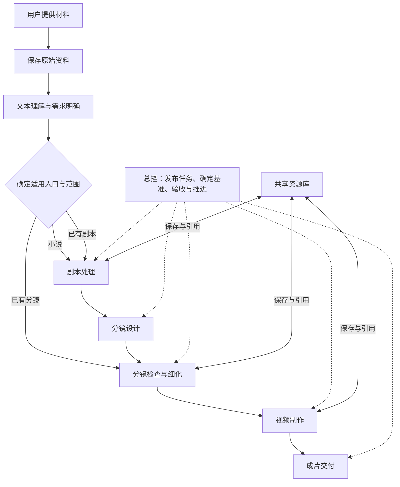
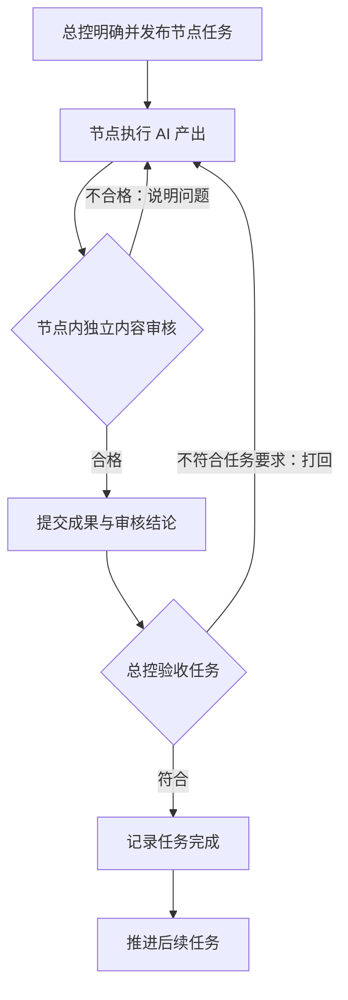
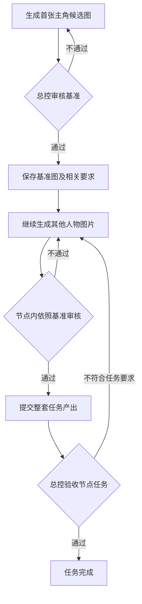

# 映序 · AI 短剧工作台产品需求文档

版本：v0.1 · 框架共识版  
日期：2026-09-17  
状态：产品框架已确认，具体交互、节点任务与实现方案待继续讨论。

本文整理本轮讨论确定的产品方向，作为后续需求讨论的基线。文中需求不等于现有系统已经实现；当前能力仍以代码和《实施状态》为准。与此前方案冲突的产品方向，以本文为准；历史文档保留用于理解已有实现，不因本文发布自动改动程序或项目数据。

## 1. 产品定位

面向个人和团队的 AI 短剧制作工作台。从用户提供的小说、剧本、分镜等材料开始，组织制作任务、参与者、资源和审核，逐步形成可交付的作品。

**核心原则：产品主流程固定，节点内任务按实际项目展开；总控把握方向、发布任务并验收，节点内部负责执行与独立内容审核。**

本轮从已有故事或制作材料开始，不将从零创作故事作为核心入口。

## 2. 产品框架

产品主阶段为：**文本理解与需求明确 → 剧本处理 → 分镜设计 → 视频制作 → 成片交付**。图中的分镜检查与细化属于分镜阶段，并为直接上传分镜提供入口。

主阶段由产品定义，总控根据材料、目标和制作范围安排本项目适用的阶段及内部任务。无需经历的处理环节可以跳过，不能将“跳过”表示为已经执行完成。不同入口不强制重新生成用户已经提供的内容。

项目流程确认前，流程大纲展示区保持空白，待讨论方案在总控群里查看；确认后展示正式流程。固定的产品框架与某个项目是否已确认制作安排，属于两个不同层面。

## 3. 主要使用场景

| 场景                   | 需要明确的事情                               | 进入方式                               |
| ---------------------- | -------------------------------------------- | -------------------------------------- |
| 上传小说，希望改编     | 做整本还是选定片段，希望做成什么、做到哪一步 | 按需理解原作，确定范围，进入剧本处理   |
| 上传小说，只做中间部分 | 指定范围、必要前情、独立成剧所需衔接         | 围绕目标范围阅读，补充必要背景后改编   |
| 上传已有剧本           | 内容成熟度、需要整理或调整的范围             | 进入剧本处理或后续分镜阶段             |
| 上传写好的分镜词       | 分镜是否合理，是否缺少人物、场景等前置资源   | 检查和细化分镜，按需补资源，再制作视频 |

上传类型判断、目标澄清和阅读策略由 AI 处理。系统负责保存与查询原始资料，不在上传存储环节擅自改写内容。混合材料、材料不完整或类型不明确的具体交互待定。

### 长文本理解

采用增量理解，允许 AI 根据目标范围与当前任务按需读取。不限于固定章节数，也不要求原作必须分章。用户上传整本小说，不代表要求制作整本。

应保留已读范围、相关依据和仍未知的信息，不能将局部阅读结论标为全书结论。具体阅读记录、阶段判断和前后文补查规则待细化。

## 4. 流程节点与任务

### 已确认规则

- 每个流程节点承接由总控发布的任务，明确这个节点要完成什么及需要交付什么。
- 节点可以包含内部子节点或子任务，承载更细的执行过程。
- 节点可以由多个 AI 参与；团队制作时也可以由人参与。
- 总控验收通过后，节点任务才标记为完成，流程再推进到后续任务。
- 产出了文件、AI 声称完成或内部审核通过，都不单独代表节点任务完成。
- 如有并行分支，后续任务应满足其必要前置条件；具体调度规则待定。

### 节点工作空间

节点承载：**总控发布的任务、参与的人与 AI、讨论记录、输入引用、产出、基准与审核记录**。

大阶段如何拆为节点，一个节点何时建立多项任务，任务能否并行，以及子流程由谁具体协调，后续逐项确定。本版不规定固定子任务清单、固定 AI 数量或嵌套层数。

## 5. 两层审核与推进机制

| 参与者           | 核心职责                                                             | 权限边界                                                             |
| ---------------- | -------------------------------------------------------------------- | -------------------------------------------------------------------- |
| 总控             | 把握整体方向，发布任务，确认基准，验收产出是否符合节点目标，推进流程 | 根据实际产出和审核结论作出任务验收决定；不逐项承担节点内部专业检查   |
| 节点执行 AI      | 根据任务和指定输入形成候选成果，按意见修改                           | 不能自行将自己的成果批准为最终交付                                   |
| 节点独立审核 AI  | 审查内容质量、合理性及是否符合既定基准，指出问题并复审               | 内容审核通过不等于总控任务验收通过；不能自行修改总控确定的方向和基准 |
| 用户或节点参与者 | 讨论需求、提出意见，按参与范围介入制作                               | 参与聊天不自动获得所有审核或流程推进权限                             |

“三方审核”在本文指独立于执行者的审核角色，不表示必须采用三个模型或三家服务商。审核 AI 的选择、独立上下文、审核标准及发生分歧后的处理待细化。

内容审核和总控任务验收分别记录，并关联实际成果版本。**一切以正式状态和审核记录为准，不以聊天中的表述为准。**

超出节点任务范围、需要调整整体方向或修改已确认基准的问题，应提交总控决定。反复返工仍无法通过时，应由总控协调；具体升级条件待定。

## 6. 中途基准审核

一个任务可能产生多项成果，允许先生成一项作为后续工作的基准。总控可以在整个任务完成之前审核这个基准。

以主角图片任务为例：

- 基准包括明确的图片版本和相关要求，例如人物年龄、气质、需要保持的特征，以及允许变化的部分。
- 总控审核基准通过后，节点内审核 AI 以此检查后续成果的一致性。
- 基准通过只允许在该任务范围内继续生产，不代表整个任务完成。
- 节点内部不得自行替换已确认基准。需要调整时交总控重新审核，并评估已有产出的影响。
- 用户可以通过总控参与基准讨论。本版不规定每次首图审核都必须额外由用户点击批准。

哪些任务必须设置基准、基准变更后的回查范围和重新审核方式待定。

## 7. 共享资源与成果

资源库统一保存原始资料和制作过程中形成的成果，支持按类型浏览与按编号引用。

| 类别         | 典型内容                                           |
| ------------ | -------------------------------------------------- |
| 原始资料     | 用户上传的小说、剧本、分镜文档与参考图片           |
| 剧本         | 整体剧本、分集内容及相关制作说明                   |
| 分镜         | 分镜内容、分镜词及后续细化结果                     |
| 图像资源     | 主角、辅助角色、服装、道具、场景、组合图、首帧图等 |
| 视频与交付物 | 镜头视频、剪辑结果、成片                           |

已确认原则：

- 每一步有实际产出的内容都应保存，不依赖聊天上下文作为唯一存储。
- 草稿、候选、已确认基准与最终交付需要区分；具体状态模型待定。
- 共用资源存储在项目公共位置，分集、分镜和任务通过编号引用明确版本。
- 20 岁与 40 岁的同一角色可以是不同形态，不能简单作为互相覆盖的修订。
- 组合资产可以在后续镜头或章节复用，不限定为生成时那个场景的一次性材料。
- 制作中发现缺少前置资源时，按需生成并审核，不要求所有资源在开始时准备齐全。
- 当前内容与历史记录分开呈现，保留来源和使用关系。

“当前可用定稿”和“最新候选版”并存时的展示与引用规则需要专门确认，不能仅按生成时间判断生产可用性。

剧本、集数与分镜之间需要可查询的结构关系，分集编号应能支持查询相邻内容。具体拆分粒度和前后集引用方式待定。

## 8. 个人与团队共用机制

**两种模式共用流程、节点、任务、资源和审核结构，主要差异是参与者与权限配置。**

| 维度         | 个人制作                         | 团队制作                             |
| ------------ | -------------------------------- | ------------------------------------ |
| 主要沟通入口 | 主要与总控沟通                   | 与总控及自己参与节点的 AI 沟通       |
| 节点参与     | 多数节点由 AI 执行，用户按需介入 | 不同人员参与不同节点，与节点 AI 协作 |
| 工作空间     | 可查看节点任务、讨论和产出       | 使用同类节点工作空间处理自己的工作   |
| 完成与推进   | 以正式审核和验收记录为准         | 同样以正式审核和验收记录为准         |

个人模式不要求用户逐节点聊天，但保留按需介入的产品方向。团队模式不只是增加聊天入口，还需要明确节点负责人和操作权限。账户、分配、成员邀请、人是否可代替 AI 执行审核、多人修改冲突等细节尚未确定。

实施仍按核心机制 → 个人闭环 → 团队扩展推进；团队是设计目标，不表示当前已有完整团队能力。

## 9. AI 协作与授权的定位

AI 是节点内任务的参与者，可以根据工作需要创建和组织。AI 数量不决定流程结构，也不要求每个任务都新建一个 AI。

总控可直接创建子 AI；其他 AI 创建或调用下级需获得总控授权。申请、决定及创建等关键消息在总控群中可见。授权机制用于约束协作调用，**不自动授予成果审核权或任务完成权**。

现有授权实现见 [下级 AI 授权](下级AI授权.md)。具体授权次数、有效期等属于当前实现参数，本需求文档不把这些默认值固定为产品框架。

## 10. 本轮与此前设计的调整

| 此前讨论或实现                                     | 本轮确定的产品方向                                                           |
| -------------------------------------------------- | ---------------------------------------------------------------------------- |
| 总控为不同项目自由生成整套主流程                   | 产品主阶段固定；总控确定适用入口、安排内部任务和子流程                       |
| 将“总控、原文分析、编剧”作为所有项目的固定制作起点 | 总控贯穿流程；按输入材料决定需要哪些内容处理环节，不强制分镜入口重做小说改编 |
| 总控同时承担所有专业内容审核                       | 节点内独立审核内容，总控确认基准并验收任务是否符合目标                       |
| 主要围绕总控群展开操作                             | 总控群掌握整体，节点拥有自己的工作与讨论空间，兼容团队参与                   |
| 等整项工作完成才统一确认                           | 支持中途基准审核；基准通过与整个任务完成分开                                 |

这些调整需要后续落实为任务模型、权限、界面和迁移方案。本轮只建立需求基线，不自动重构现有程序。

## 11. 下一轮待讨论清单

| 编号 | 议题           | 需要明确的问题                                                     |
| ---- | -------------- | ------------------------------------------------------------------ |
| Q01  | 入口与需求明确 | 哪些信息必须先明确，哪些可以边做边讨论？怎样选择制作范围和入口？   |
| Q02  | 节点任务定义   | 总控发布一项任务时必须包含什么？如何拆分内部子任务？               |
| Q03  | 基准产出       | 哪些任务要先定基准，谁提出基准审核，怎样保存可保持与可变化的特征？ |
| Q04  | 节点内容审核   | 审核者如何配置、读取哪些依据、怎样返工、争议怎样上报？             |
| Q05  | 总控任务验收   | 如何判断交付完整且符合需求，部分通过怎样处理？                     |
| Q06  | 流程调度       | 串行、并行、暂停、返工和重新执行怎样影响后续节点？                 |
| Q07  | 资源状态与引用 | 基准、定稿、候选、历史如何区分，修改后哪些任务需要重新检查？       |
| Q08  | 节点聊天       | 总控群与节点讨论如何关联，哪些关键消息需要汇总给总控？             |
| Q09  | 团队参与       | 人员如何分配到节点，各自可以修改、提交、审核哪些内容？             |
| Q10  | 现有系统调整   | 哪些能力沿用，哪些需要改造，已有项目和会话如何保持可用？           |

建议从 Q01 开始，按实际制作顺序逐步讨论。每次确认后更新本文；尚未讨论的细节继续保持待定，不将技术实现默认值当作用户已确认的需求。

## 12. 框架验收情景

以下用于后续实现验收，不表示已通过产品级实测：

1. 上传整本小说但只制作中间片段，系统能围绕指定范围开展增量理解与改编。
2. 直接上传分镜词，可以进入分镜检查，缺少的人物或场景资源在过程中补充。
3. 节点内审核通过但总控认为不符合任务目标时，任务仍未完成，并能返工。
4. 主角首张图获得总控基准确认后，节点能继续生成其他图，且不会提前将整项任务标为完成。
5. 同一套任务与资源机制可由个人主要通过总控操作，也可由团队成员在对应节点参与。
6. 更换 AI 或重新打开会话后，任务、基准、产出和审核仍可通过独立记录恢复，不依赖聊天记忆。
